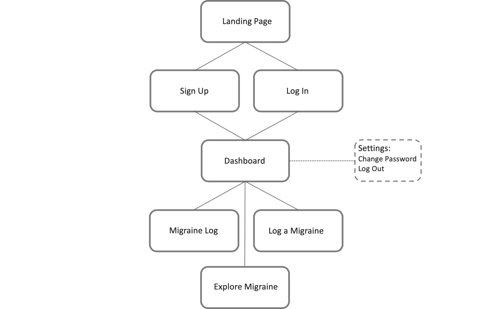

# Migraine App

This migraine app allows users to log their migraines along with details of the migraine. Users can view their logs over time to find common symptoms and remedies, and they can also share with healthcare professionals so they may find a suitable treatment moving forward.

<!-- ## Working Prototype -->
<!-- Link will go here -->

## Site Map: MVP

## User Stories

**Landing Page**

As a new user I want to understand the purpose of the app so I can decide if I want to sign up.

**Sign Up Page**

As a new user I want to sign up for the app so I can use it and save my migraine information on my account.

**Log In Page**

As a returning user I want to log in so I can have access to my saved migraine records.

**Dashboard**

As a returning user I want to log a new migraine record, view my saved records, and see migraine articles so I can explore my trends and update as I wish.

**Migraine Log**

As a returning user I want to view my migraine log so I can find trends, view what has helped me previously, and share with a healthcare professional so I may find a suitable treatment moving forward.

**Log a Migraine**

As a returning user I want to record a migraine so I can track symptoms, triggers, remedies, and overall commonalities within my migraines.

**Explore Migraine Feature**

As a returning user I want to explore migraine articles and news so I can become more educated about migraines.

**Settings Page**

As a returning user I want to access my user settings so I can update my secure password or log out at my convenience.

This project was bootstrapped with [Create React App](https://github.com/facebook/create-react-app).

## Available Scripts

In the project directory, you can run:

### `npm start`

Runs the app in the development mode. 
Open [http://localhost:3000](http://localhost:3000) to view it in the browser.

The page will reload if you make edits. 
You will also see any lint errors in the console.

### `npm test`

Launches the test runner in the interactive watch mode. 
See the section about [running tests](https://facebook.github.io/create-react-app/docs/running-tests) for more information.

### `npm run build`

Builds the app for production to the `build` folder. 
It correctly bundles React in production mode and optimizes the build for the best performance.

The build is minified and the filenames include the hashes. 
Your app is ready to be deployed!

See the section about [deployment](https://facebook.github.io/create-react-app/docs/deployment) for more information.

### `npm run eject`

**Note: this is a one-way operation. Once you `eject`, you can’t go back!**

If you aren’t satisfied with the build tool and configuration choices, you can `eject` at any time. This command will remove the single build dependency from your project.

Instead, it will copy all the configuration files and the transitive dependencies (Webpack, Babel, ESLint, etc) right into your project so you have full control over them. All of the commands except `eject` will still work, but they will point to the copied scripts so you can tweak them. At this point you’re on your own.

You don’t have to ever use `eject`. The curated feature set is suitable for small and middle deployments, and you shouldn’t feel obligated to use this feature. However we understand that this tool wouldn’t be useful if you couldn’t customize it when you are ready for it.

## Learn More

You can learn more in the [Create React App documentation](https://facebook.github.io/create-react-app/docs/getting-started).

To learn React, check out the [React documentation](https://reactjs.org/).

### Code Splitting

This section has moved here: https://facebook.github.io/create-react-app/docs/code-splitting

### Analyzing the Bundle Size

This section has moved here: https://facebook.github.io/create-react-app/docs/analyzing-the-bundle-size

### Making a Progressive Web App

This section has moved here: https://facebook.github.io/create-react-app/docs/making-a-progressive-web-app

### Advanced Configuration

This section has moved here: https://facebook.github.io/create-react-app/docs/advanced-configuration

### Deployment

This section has moved here: https://facebook.github.io/create-react-app/docs/deployment

### `npm run build` fails to minify

This section has moved here: https://facebook.github.io/create-react-app/docs/troubleshooting#npm-run-build-fails-to-minify
